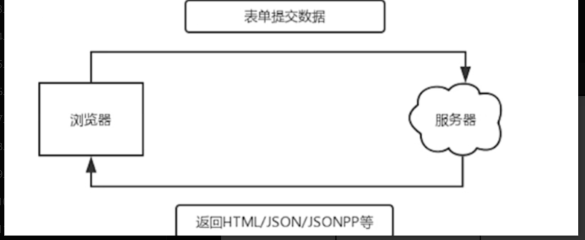
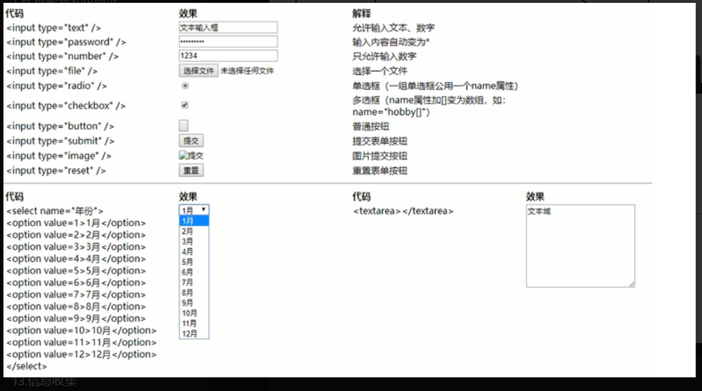

## 1.前后端交互
**前端**：负责用户界面展示（HTML/CSS）和交互逻辑（JavaScript），通过表单、AJAX等方式与后端发送数据请求

**后端**：如php，python，java，C#等，负责接受前端数据、处理业务逻辑（如数据验证、权限判断）、与数据库交互，最终返回处理结果（如HTML页面，JSON数据）
--- 
### 表单验证
+ 表单在网页中主要负责数据采集
+ 一个表单在网页中由三个基本组成：
    - 表单标签	<form>
        * 包括了处理表单数据所用动态脚本的URL以及数据提交到服务器的方法
    - 表单域
        * 包括文本框、密码框、隐藏域、多行文本框、复选框、单选框、下拉选择和文件上传框等
    - 表单按钮
        * 包括提交按钮、复位按钮和一般按钮
        * 用于将数据上传到服务器的动态脚本或取消输入
        * 可用来控制其他定义了处理脚本的处理工作



``` html
<form action="test.php" method="get"></form>
<!--表单标签<form>-->
<!--action指定数据提交到后端的处理脚本为test.php，若为空则提交到当前页面-->
<!--method指定提交方法是get-->
```
`<meta charset="UTF-8"> <!--保障中文不会乱码-->`
``` html
<input type="text"/><br>
<input type="password"/><br><!--password为密码模式，密文不显示，html的注释方式-->
<input type="number"/><br>
<input type="file"/><br>
<input type="radio"/><br>
<input type="checkbox"/><br>
<input type="submit"/><br>
<input type="image"/><br>
<input type="reset"/><br>
```
*** 

创建分数提交表单，判断分数大于等于六十，输出及格，否则输出不及格或者成绩非法

`action` 用于做文件跳转

`method`定义请求方法

`name` 数据传输到后端之后需要接受的名字
```html
<meta charset="UTF-8"> 

<form action="test.php" method="post">
<!--action表示跳转到哪个页面-->
<input type="text" name="grades"/><br>
<input type="submit" value="提交分数">
</form>
```
`test.php`
```php
<?php
$a = $_POST['grades'];
if ($a >= 60)
echo '及格'
else
echo '不及格或成绩非法'
?>
```
- 预定义变量，php代码本身里面已经定义好的变量，他们有自己独特的用处

```php
<?php
#接收传参值
$_GET['grades']
$_POST['grades']
$_REQUEST['grades']
?>
```
--- 
## 2.PHP与数据库交互
- PHP函数：连接、选择、执行、结果、关闭等
- 参考：`https://www.runoob.com/php/php-ref-mysqli.html`
- 常用：
	- `mysqli_connect()`打开一个到MySQL的新连接
	- `mysqli_select_db()`更改链接的默认数据库
	- `mysqli_query()`执行针对某个数据库的查询
	- `mysqli_fetch_row()`从结果中取得某一行，并作为枚举数组返回
	- `mysqli_fetch_array()`从结果汲取所有对象变为数组
	- `mysqli_close()`关闭先前打开的数据库连接

> 连接查询后的结果，不支持直接展示出来

> 我们需要先把这个数据给他转换成数组，然后才可以进行取出和使用

```php
<?php
	$conn = mysqli_connect('localhost','root','123456','mysql');
	$sql =  'select *from day;';
	$result = mysqli_query($conn,$sql);
	$a = mysqli_fetch_array($result);//执行一次只获取一行值，可利用循环语句，全部取出
	var_dump($a);#常用的调试函数，用于输出变量的详细信息，包括变量值和变量类型
	echo $a['id'];
	while($a = mysqli_fetch_array($result)){
		echo $a['username'].'<br>';
	}
?>
```
**要么理解原理，要么死记硬背**

判断是否成年

```html
<meta charset="UTF-8">
<from action="test.php" method="post">
	姓名：<input type="text" name="name"><br>
	年龄：<input type="text" name="age"><br>
	<iuput type="submit" value=“查询”>
</from>
```

`test.php`

```php
<?php
	//接收前端传来的数据
	$name = $_POST['name'];
	$age = $_POST['age'];
	
	//判断传输数据是否符合条件
	$conn = mysqli_connect('localhost','root','123456','mysql');
	$sql = "select age from day where username='$name' and age='$age';";
	//需要执行的SQL语句
	$result = mysqli_query(%conn,$sql);
	while($a = mysqli_fetch_array($result))
	{
		echo $a['age'].'<br>';
		if($a['age'] > 18)
			echo "你已成年";
		else
			echo "你未成年或年纪不合法";
	}
	
?>
```