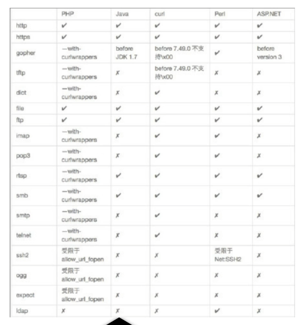

## 1.漏洞原理
由攻击者构造形成服务端发起请求的的一个安全漏洞

一般情况下SSRF用来访问目标服务器的内部系统，将目标网站当中间人

### 形成原理
大都是由于服务端提供了从其他服务器应用获取数据的功能，且没有对目标地址做过滤与限制。比如从指定URL地址获取网页文本内容，加载指定地址的图片，文档，等等。

```PHP
<?php
    $url=$_GET['url'];  // 获取 GET 请求中的 url 参数
    $ch=curl_init();  // 初始化 cURL 对象
    curl_setopt($ch,CURLOPT_URL,$url);  // 设置请求的 URL 地址
    curl_setopt($ch,CURLOPT_SSL_VERIFYPEER,false);  // 禁止 cURL 验证对等证书
    curl_setopt($ch,CURLOPT_SSL_VERIFYHOST,false);  // 禁止验证 SSL 证书的主机名
    curl_setopt($ch,CURLOPT_RETURNTRANSFER,true);  // 设置返回结果为字符串
    $output = curl_exec($ch);  // 执行 cURL 请求
    curl_close($ch);  // 关闭 cURL 对象
    echo $output;  // 输出请求结果
?>

```

### 常见漏洞点
1. 能够对外发起网络请求的地方
2. 从远程服务器请求资源
3. 数据库内置功能
4. Webmali收取其他邮箱邮件
5. 文件处理，编码处理，属性信息处理（ffpmg、imageMaic、DOCX、PDF、XML处理器）

## 2.漏洞利用
### 协议
#### file协议
```URL
?参数=file://绝对路径
```
使用file协议获取服务器文件，可用于获取敏感信息
#### ftp协议
```URL
?参数=ftp://目标IP:端口号
```
使用ftp协议探测端口是否开放，当响应时间在2秒左右，即是关闭，8-10秒则端口开放
#### gopher协议
可以构建各种数据包，主要用于解决漏洞点不在GET传参
```URL
?参数=gopher://<host><port>/<gopher-ath>

#示例

gopher://192.168.10.130/_POST%20/1.txt%20HTTP/1.1
Host:192.168.10.130:80

#格式转换
#空格换为%20
#换行换为%0d0a
gopher://192.168.10.130/_POST%20/1.txt%20HTTP/1.1%0d0aHost:192.168.10.130:80%0d0a
```
