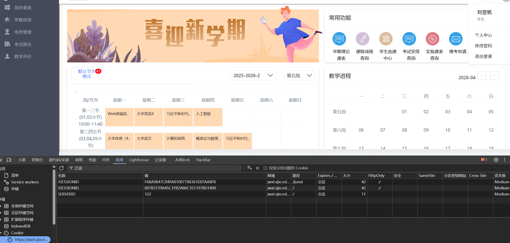
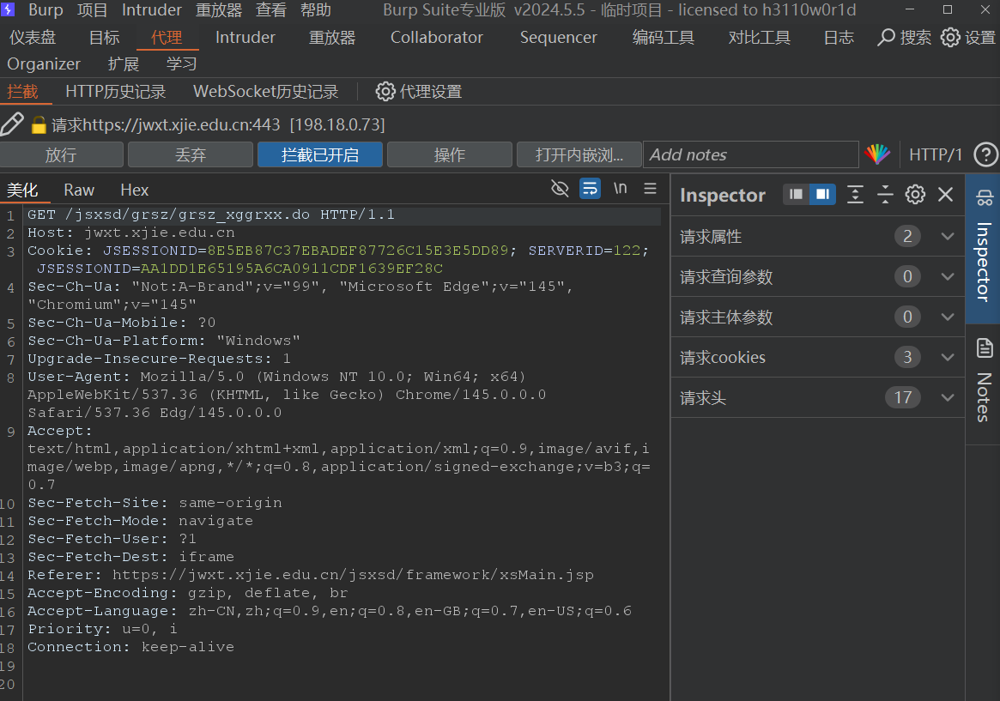
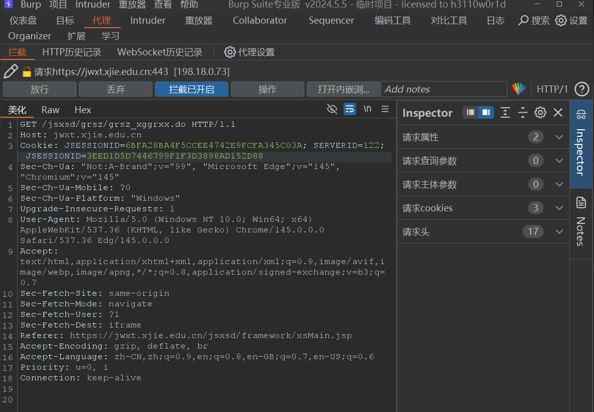
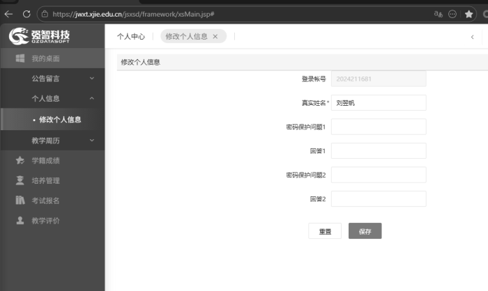

**漏洞标题**：会话标识未绑定导致水平越权漏洞 

**漏洞类型**：越权访问 / 会话劫持 

**危害等级**：高危 

**影响范围**：`https://jwxt.xjie.edu.cn/jsed/framework/jsMain.jsp` 及相关业务接口 

**漏洞描述** 系统对用户会话标识（`JSESSIONID`）缺乏有效校验，攻击者可通过替换请求中的 `Cookie` 字段，在无需密码、无需验证码的情况下，直接以其他用户身份执行操作，实现水平越权，查看或修改他人敏感信息。 

### 复现步骤
账号 A：2024211681(刘**)
密码 A：123qqq,,,
账号 B：2024211408(付**)
密码 B：gcxy111111
1. 登录账号A（刘**），获取其会话Cookie： ``` Cookie: JSESSIONID=6BFA28BA4F5CCEE4742E9FCFA345C03A; SERVERID=122; JSESSIONID=3EED1D5D7446799F1F3D3898AD152D88 ```

2. 登录账号B（付**），访问 `https://nwt.xjtu.edu.cn/jsed/framework/jsMain.jsp`，使用Burp Suite抓取账号B访问修改个人信息页面请求。 

3. 将请求包中的 `Cookie` 替换为账号A的Cookie，然后放行。 

4. 页面直接显示账号A的个人信息或业务数据，成功实现水平越权。

---- 
### 漏洞影响
- 攻击者可批量获取大量用户的敏感信息，如个人资料、联系方式、学习/工作记录等。 
- 攻击者可完全控制受害者账号，进行修改密码、提交数据、删除信息等恶意操作。
---- 
### 修复建议 
1. **绑定会话与客户端信息**：在服务端生成会话时，将 `JSESSIONID` 与客户端的IP地址、User-Agent等信息进行绑定。每次请求时，校验这些信息是否一致，不一致则销毁会话。 
2. **增加会话有效期与强制验证**：设置合理的会话超时时间，对敏感操作（如修改密码、查看隐私信息）要求用户重新输入密码或进行二次验证。 
3. **使用更安全的会话管理机制**：考虑使用HttpOnly、Secure等Cookie属性，防止XSS等攻击窃取Cookie；或采用Token-based认证，并对Token进行签名和时效控制。