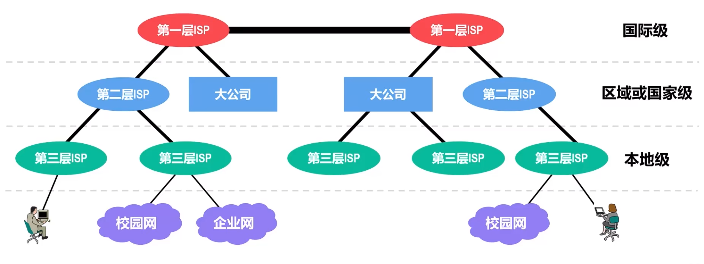
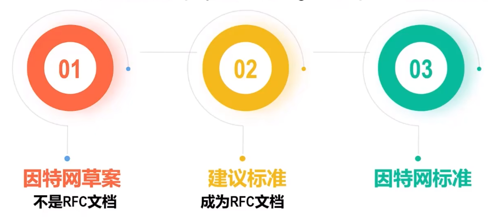
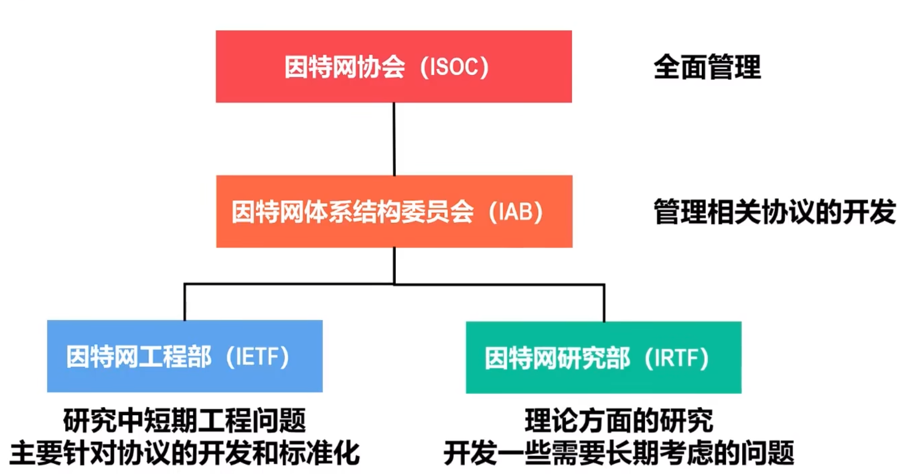
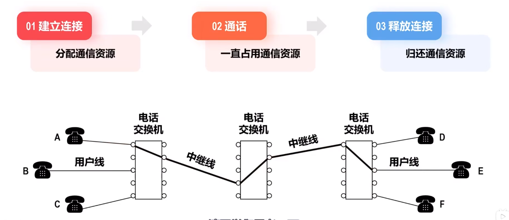
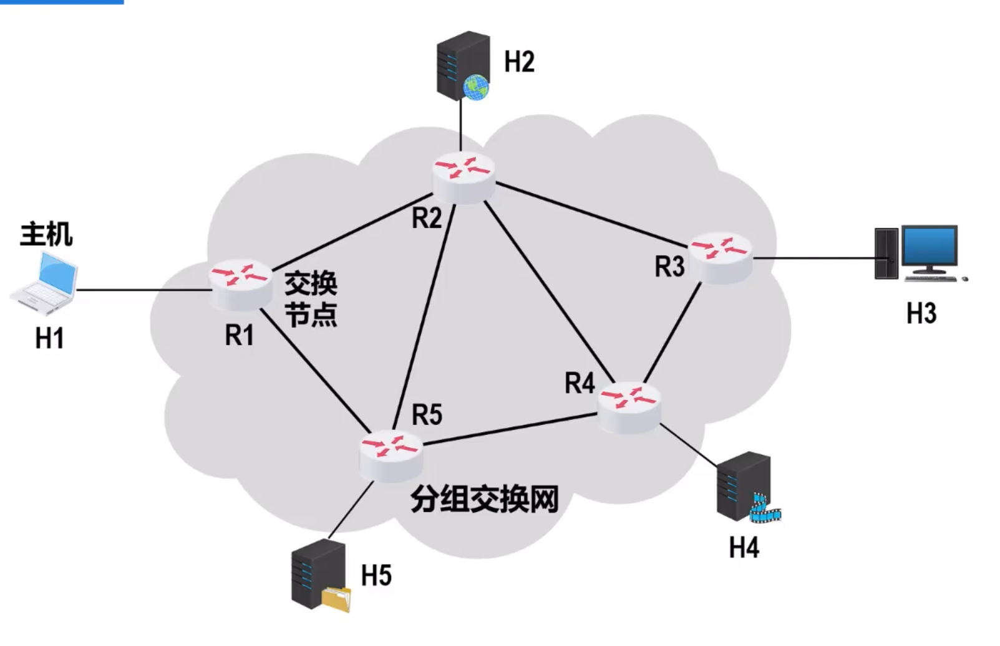
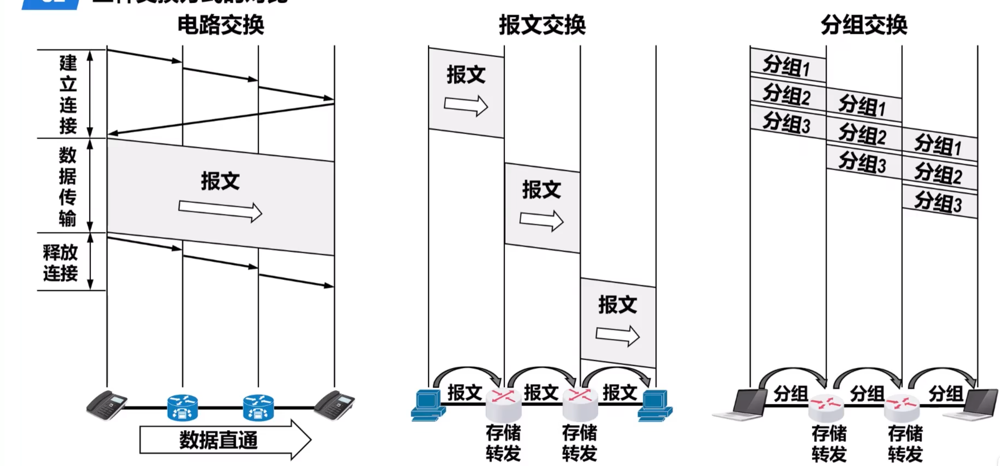

## 1.1 因特网概述
### 1.网络、互联网与因特网的区别与关系
网络：通过通信电路连接起来、独立自治的计算机的集合，有连接介质、交换数据的能力，一般指局域网

互联网 internet：有多个网络连接而成的网络，两个或多个局域网通过路由器连接起来形成，本质是一种结构 通用名词 使用任意通信协议

因特网 Internet：目前全球最大的、开放的、由无数个网络连接而成的**特定的**那个互联网 专用名词 使用TCP/IP协议族作为通信规则

---
- 若干节点和链路互联形成网络
- 若干网络通过路由器互联形成互联网
- 因特网是当今世界上最大的互联网
### 2.因特网简介
#### 因特网服务提供者 ISP
- 将局域网接入因特网的中间人，如：中国电信、移动、联通
- 因特网已发展成为基于ISP的多层结构的互连网络

#### 因特网的标准化工作
- 是面向公众的，其任何一个建议标准在成为因特网标准之前都以RFC技术文档的形式在因特网上面发表
- RSC 请求评论 任何人都可以免费下载、评论、发表建议`www.ietf.org/rfc.html`

#### 因特网的管理机构

#### 因特网的组成
- 依据功能划分，可划为两部分：
	- 核心部分：由大量异构网络和连接这些网络的路由器构成
	- 边缘部分：由连接在因特网上面的用户设备（称为主机）构成
	- 核心为边缘提供连通性和数据交换等服务
	- 路由器在网络核心部分起特殊作用，是一种专用计算机，是实现分组交换的关键构件，其任务是转发收到的分组，是网络核心部分最重要的功能
---
## 1.2电路交换、分组交换和报文交换
### 1.电路交换

计算机之间的数据传送是突发式的，使用电路交换来传送计算机数据，线路的传送效率低
### 2.分组交换

- 发送方：
	- 构造分组
	- 发送分组
- 交换节点：
	- 缓存分组
	- 转发分组
- 接收方：
	- 接收分组
	- 还原报文
--- 
- 优点：
	- 没有建立连接和释放连接的过程
	- 分组传输过程逐段占用通信链路，有较高的通信电路利用率
	- 交换节点可以为每个分组独立选择转发路由，使网络有较好生存性
- 缺点：
	- 分组首部带来了额外的传输开销
	- 交换节点存储转发会照成一定的时延
	- 无法确保通信时，端到端的通信资源全部可用，在通信量较大时可能造成网络拥塞
	- 分组可能出现失序、丢失的问题
### 3.报文交换
- 报文交换是分组交换的前身
- 在报文交换中，报文被**整个**的发送，而不是拆分成诺干个分组进行发送
- 交换节点将报文整体接收完成后才能查找转发表，将整个报文钻发到下个节点
- 因此，报文交换比分组交换带来的转发时延要长很多，需要交换节点拥有的缓存空间也大很多
### 4.三种交换方式的对比

- 若要连续传授大量的数据，并且数据传送时间远大于建立连接的时间，则使用电路交换会有较高的传送效率。但计算机的数据传送往往是突发式的，采用电路交换时通信电路的利用率会很低
- 报文交换和分组交换是不需要建立连接（即预先分配通信资源），在传送计算机的突发数据时可以提高通信线路的利用率
- 将报文构造成若干个小的分组进行交换，比整个报文进行报文交换的时延小，而且还可以避免较长的报文长时间占用链路，有利于差错控制，同时具有更好的灵活性
## 1.3计算机网络的定义与分类
### 1.计算机网络的定义
> 没有精确的统一的定义
> 在不同阶段，不同的定义反映了当时计算机网络的发展水平

早期的简单定义：互联、自治的计算机集合

现阶段计算机网络的较好定义：计算机网络主要是有一些通用的、可编程的硬件互联而成，而这些硬件比非专门用来实现某一目的（例如：传输数据或视频信号）。这些可编程的硬件能用来传送多种不同类型的数据，并能够支持广泛的和日益增长的应用
- 可编程的硬件：不限于计算机，而是包括了智能手机、具有网络功能的传感器以及智能家电等智能硬件，这些硬件一定包含有中央处理单元（CPU）
- 各类应用：计算机网络并非只用来传送数据，而是能够基于数据传送进而实现各种各样的应用，包括今后可能出现的各种应用
### 2.计算机网络的分类
- 按照交换方式分类：
	- 电路交换
	- 报文交换
	- 分组交换
- 按使用者分类：
	- 公用网（因特网）
	- 专用网（军队、铁路、电力、银行）
- 按传输介质分类：
	- 有线网络
	- 无线网络
- 按覆盖范围分类：
	- 广域网WAN
	- 城域网MAN
	- 局域网LAN
	- 个域网PAN
- 按拓扑结构分类：
	- 总线型
	- 星型
	- 环型
	- 网状型
## 1.4计算机网络的性能指标
- 从不同方面度量计算机网络性能
- 常用的八个计算机网络性能指标：
	- 速率
	- 带宽
	- 吞吐量
	- 时延
	- 时延带宽积
	- 往返时间
	- 