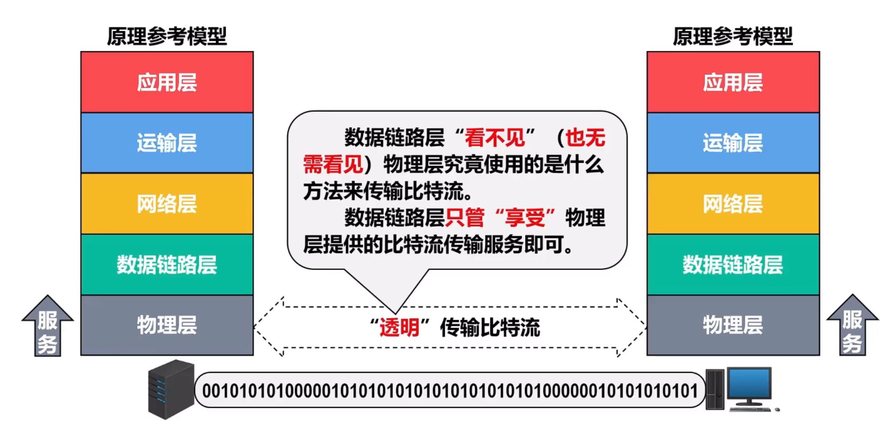

## 2.1 物理层概述
> OSI 参考模型的最底层，TCP/IP 模型中属于网络接口层的一部分。
### 1.物理层实现功能
在物理传输介质上为数据链路层提供**透明的比特流传输**（对数据链路层而言，物理层的存在仅仅是提供了一条传输比特的管道）。

### 2.物理层接口特性

- 机械特性
	- 形状和尺寸
	- 引脚数目和排列
	- 固定和锁定装置
- 电气特性
	- 信号电压范围
	- 阻抗匹配情况
	- 传输速率
	- 距离限制
- 功能特性
	- 规定接口电缆的各条信号线的作用
- 过程特性
	- 规定在信号线上传输比特流的一组操作过程，包括各信号间的时序关系

---

## 2.2物理层下面的传输媒体
**传输媒体**是计算机网络设备之间的物理通路，也成为传输介质或传输媒介

传输媒体并不包含在计算机网络体系结构中

### 1.传输媒体的分类

- 导向型传输媒体（固体媒体）
	- 同轴电缆
	- 双绞线
	- 光纤
- 非导向型传输媒体（自由空间）
	- 无线电波
	- 微波
	- 红外线
	- 大气激光
	- 可见光

### 2.导向型传输媒体
- 同轴电缆
	- 基带同轴电缆（50欧）
		- 用于数字传输，在早期局域网中广泛使用
	- 宽带同轴电缆（75欧）
		- 用于模拟传输。目前主要用于有线电视的入户线
同轴电缆价格较贵且布线不够灵活和方便。随着技术的发展和集线器的出现，在局域网领域基本上都采用双绞线作为传输媒体

- 双绞线
	- 

- 光纤
	- 
光纤通信利用光脉冲在光纤中的传递来进行通信。由于可见光的频率非常高（约为10⁸MHz量级），因此一个光纤通信系统的**传送带宽远大于**目前其他各种传输媒体的带宽
光在光纤中的传输方式是不断地全反射

--- 
> 总结：物理层为比特流传输定义了一套完整的机械、电气、功能与规程标准，提供信号编码、多路复用、传输模式与信道复用等能力，并为上层屏蔽物理介质细节，是网络通信的基础物理通路。